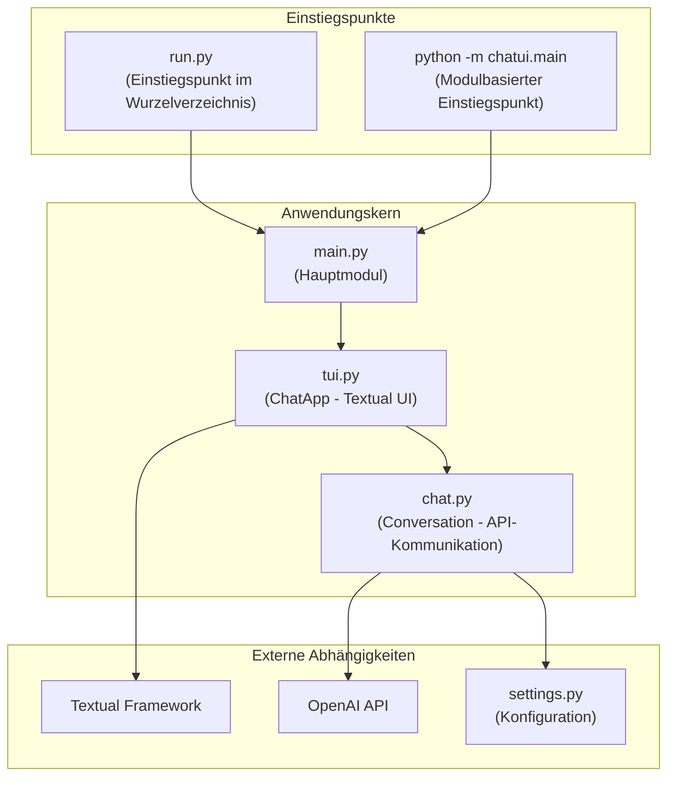
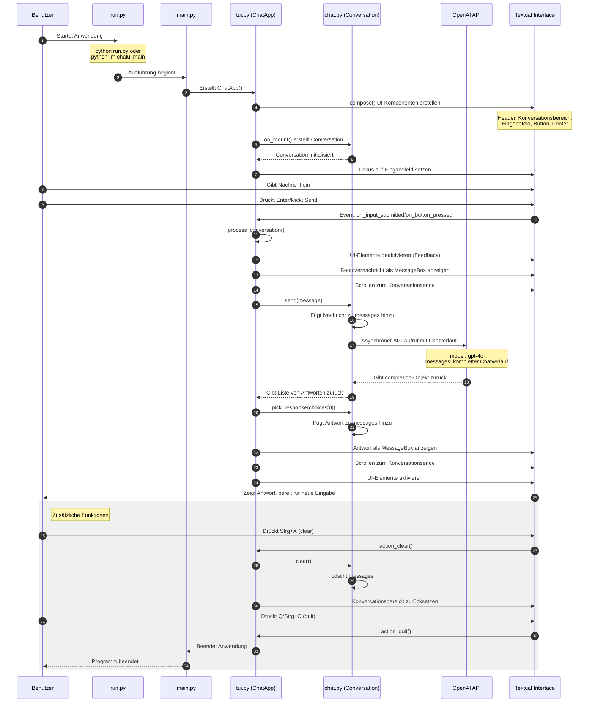
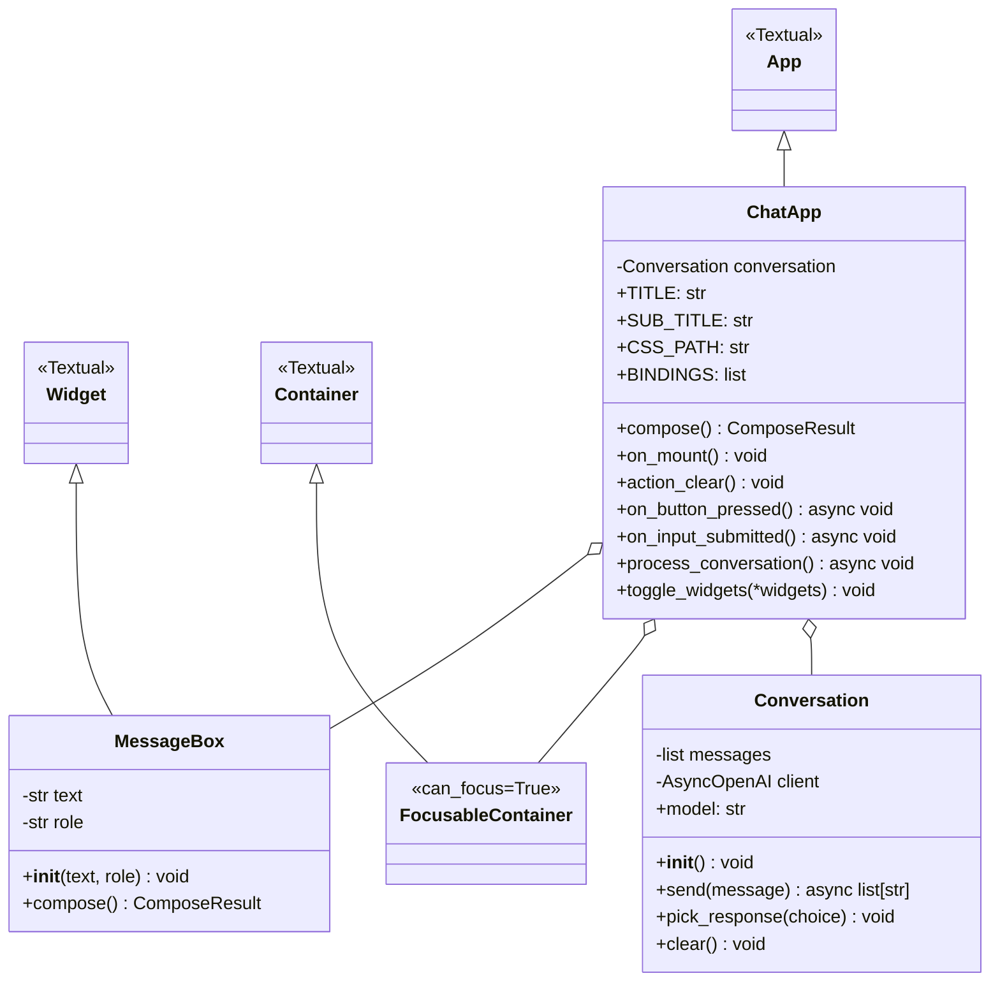
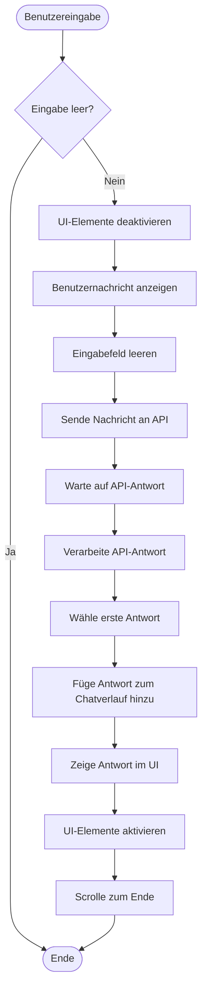

# Chatui Architektur und Kommunikationsfluss

Dieses Dokument beschreibt die Architektur und den Kommunikationsfluss der chatui-Anwendung, einschließlich der Startsequenz, der Nachrichtenverarbeitung und der API-Kommunikation.

## Inhaltsverzeichnis

- [Übersicht](#übersicht)
- [Komponenten](#komponenten)
- [Sequenzdiagramm: Vollständiger Kommunikationsfluss](#sequenzdiagramm-vollständiger-kommunikationsfluss)
- [Klassendiagramm: Anwendungsstruktur](#klassendiagramm-anwendungsstruktur)
- [Ablaufdiagramm: Nachrichtenverarbeitung](#ablaufdiagramm-nachrichtenverarbeitung)
- [Detaillierter Ablaufplan](#detaillierter-ablaufplan)

## Übersicht

Die chatui-Anwendung ist eine Terminal-basierte Benutzerschnittstelle (TUI) für Konversationen mit der OpenAI API. Sie nutzt das Textual-Framework für die Benutzeroberfläche und kommuniziert asynchron mit der OpenAI API.

## Komponenten

Die Anwendung besteht aus mehreren Hauptkomponenten:

## Sequenzdiagramm: Vollständiger Kommunikationsfluss

Das folgende Sequenzdiagramm zeigt den vollständigen Kommunikationsfluss von der Anwendungsinitialisierung bis zur Antwortanzeige:

## Klassendiagramm: Anwendungsstruktur

Das folgende Klassendiagramm zeigt die wichtigsten Klassen der Anwendung und ihre Beziehungen:

## Ablaufdiagramm: Nachrichtenverarbeitung

Dieses Diagramm zeigt den Ablauf der Nachrichtenverarbeitung in der Anwendung:

## Detaillierter Ablaufplan

### Startprozess der Anwendung

1. **Ausführung von run.py** oder **python -m chatui.main**
   - Python lädt das chatui-Paket und dessen Abhängigkeiten
   - Die `main.py` wird ausgeführt und erstellt eine Instanz von `ChatApp`

2. **Initialisierung der ChatApp** (`main.py` → `tui.py`)
   - Die `ChatApp`-Klasse erbt von Textual's `App`
   - Die Methode `compose()` wird aufgerufen, um die UI-Komponenten zu erstellen:
     - Header
     - Konversationsbereich (FocusableContainer)
     - Eingabebereich (Input und Send-Button)
     - Footer mit Tastenkombinationen

3. **Initialisierung der Konversation** (`on_mount` in `tui.py`)
   - Ein `Conversation`-Objekt wird erstellt
   - Der OpenAI-Client wird mit dem API-Schlüssel aus den Einstellungen initialisiert
   - Die Eingabe erhält den Fokus

### Kommunikationszyklus: Senden einer Nachricht

4. **Benutzereingabe**
   - Benutzer gibt Text in das Eingabefeld ein
   - Benutzer drückt Enter oder klickt auf den "Send"-Button

5. **Event-Handling** (`on_button_pressed` oder `on_input_submitted` in `tui.py`)
   - Beide Events leiten zur `process_conversation`-Methode weiter
   - Die Methode prüft, ob die Eingabe nicht leer ist
   - Das Eingabefeld und der Button werden deaktiviert (UI-Feedback)

6. **Anzeigen der Benutzernachricht**
   - Die Benutzernachricht wird als `MessageBox` mit der Rolle "question" erstellt
   - Die MessageBox wird im Konversationsbereich angezeigt
   - Die Scrollposition wird zum Ende des Konversationsbereichs gesetzt
   - Das Eingabefeld wird geleert

7. **Senden der Nachricht an die API** (`process_conversation` in `tui.py` → `send` in `chat.py`)
   - Die Nachricht wird an die `send`-Methode der Conversation-Klasse übergeben
   - Die Nachricht wird dem internen Nachrichtenverlauf (`self.messages`) als Nutzer-Rolle hinzugefügt
   - Ein asynchroner API-Aufruf an OpenAI wird vorbereitet:
     - Das aktuelle Modell wird spezifiziert (gpt-4o)
     - Der gesamte Chatverlauf wird als `messages` mitgesendet
   - Der API-Aufruf wird mit `await` abgewartet

### Kommunikationszyklus: Empfangen einer Antwort

8. **Verarbeitung der API-Antwort** (`send` in `chat.py`)
   - Die API gibt ein `completion`-Objekt zurück
   - Die Methode extrahiert den Textinhalt jeder choice aus dem completion-Objekt
   - Eine Liste von Antworten wird zurückgegeben

9. **Auswahl und Verarbeitung der Antwort** (`process_conversation` in `tui.py`)
   - Die erste Antwort wird automatisch ausgewählt (`choices[0]`)
   - Die ausgewählte Antwort wird an die `pick_response`-Methode der Conversation übergeben
   - `pick_response` fügt die Antwort zum internen Chatverlauf als Assistant-Rolle hinzu

10. **Anzeigen der Antwort**
    - Eine neue `MessageBox` mit der Rolle "answer" wird erstellt
    - Diese Box wird im Konversationsbereich angezeigt
    - Die Scrollposition wird erneut zum Ende gesetzt
    - Das Eingabefeld und der Button werden wieder aktiviert

11. **Bereit für die nächste Eingabe**
    - Der Benutzer kann eine neue Nachricht eingeben
    - Der gesamte Verlauf bleibt erhalten und wird bei zukünftigen API-Aufrufen mitgesendet

### Zusätzliche Funktionen

12. **Konversation löschen** (über die "clear"-Aktion mit Strg+X)
    - Die `clear`-Methode der Conversation wird aufgerufen
    - Die interne Nachrichtenliste wird zurückgesetzt
    - Der Konversationsbereich wird geleert und neu erstellt

13. **Beenden der Anwendung** (über die "quit"-Aktion mit Q oder Strg+C)
    - Die Anwendung wird ordnungsgemäß beendet
    - Alle Ressourcen werden freigegeben